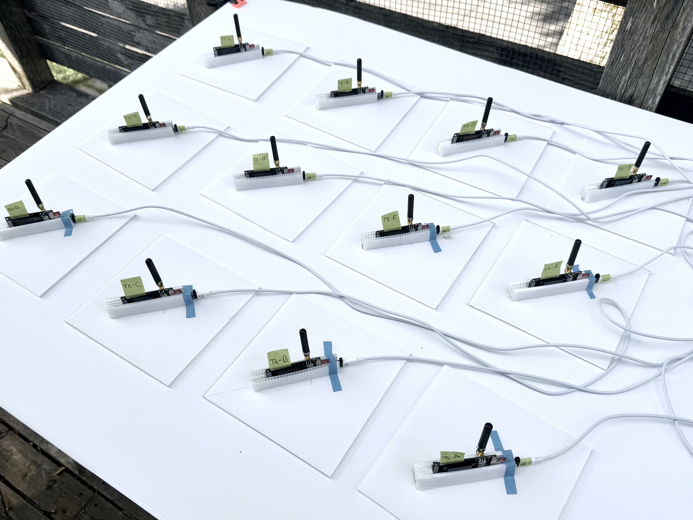
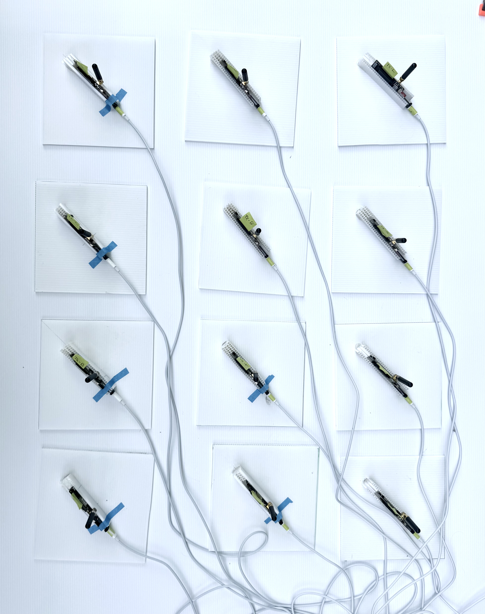
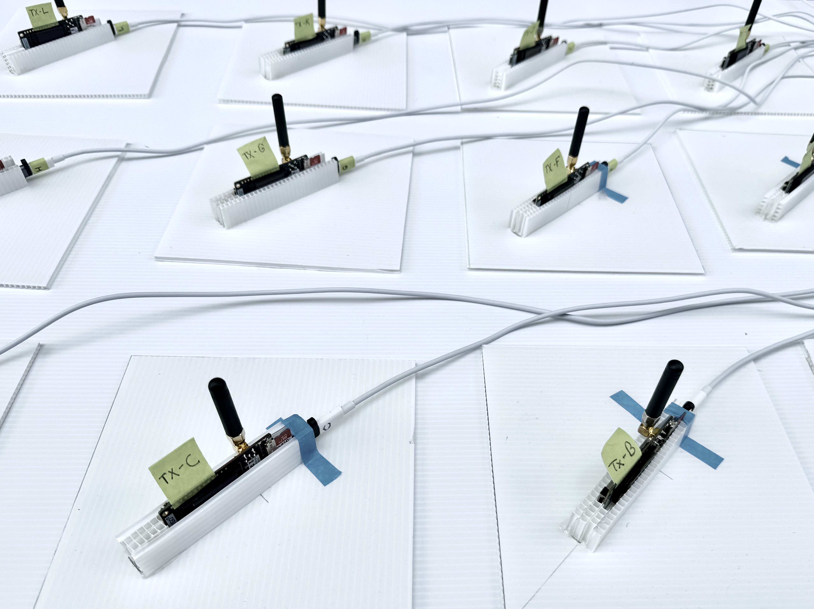
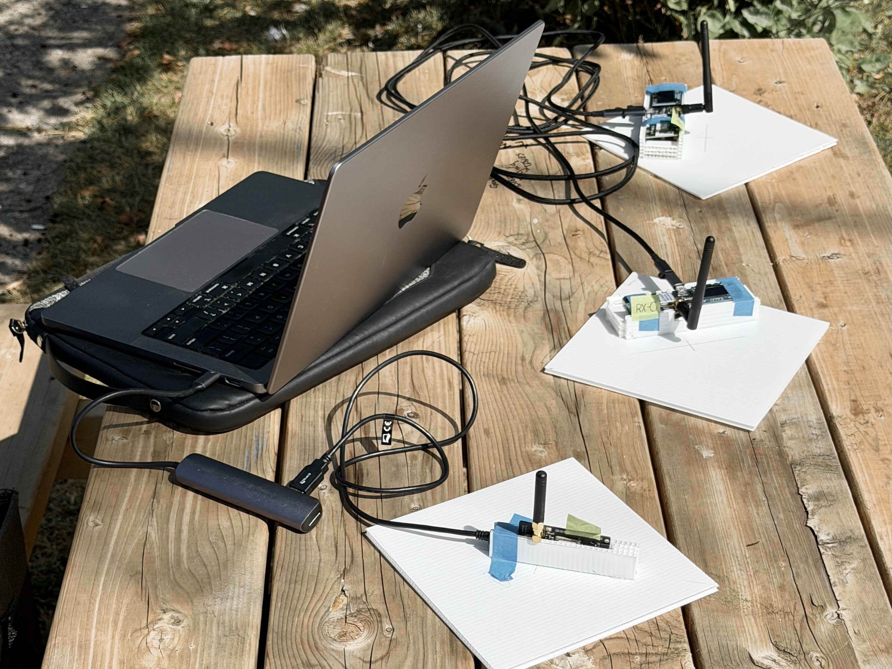

# LoRa Belief-Reporting Proof of Concept

This repository contains a small-scale ESP32/LilyGO LoRa proof of concept for studying **receiver-side report preservation** under constrained point-to-point LoRa replay.

Synthetic sensing packets carry communication metadata and belief/usefulness metadata. Physical LoRa receivers provide receiver-side evidence: packet identities, packet counts, RSSI, SNR, receiver inter-arrival timing, sequence gaps, and manifest-relative preservation or distortion of the planned replay structure.

The central research motivation is:

> information delivery is not the same as information usefulness.

The current focus of the repository is a **manifest-bound physical LoRa replay testbed**. A replay manifest specifies the intended transmitter identities, reporting schedules, SEND/SKIP structure, and synthetic metadata. Receiver logs are then parsed and compared against that manifest.

This is a laboratory proof of concept. It is not a LoRaWAN system, not an operational adaptive reporting policy, not a live belief-maintenance controller, and not an operational wildfire system.

## Current validated state

Current latest milestone on `main`:

- `v5.34-three-receiver-final-condition-synthesis`

This milestone synthesizes the final three-receiver physical replay experiment across three physical conditions:

| Condition | Runs | Description |
|---|---|---|
| A | 040--042 | Close indoor bench |
| B | 043--045 | Indoor residential no-line-of-sight, approximately 30 ft |
| C | 046--048 | Outdoor residential/treed path, approximately 300--500 m, possible line of sight |

The synthesis note is:

- `docs/development/run040_048_three_receiver_final_condition_synthesis.md`

All receiver-specific manifest replay bundles passed validation across the final-condition runs. The results show that the manifest-bound reporting structure remains visible in receiver-side evidence, but is not identically preserved across receivers or physical conditions.

## Physical setup images

The following images document the physical replay setup and receiver/transmitter context for the final three-receiver work.

## Final three-receiver result

The final experiment compares three independent receiver-side observations of the same fixed twelve-transmitter manifest replay.

Receivers:

| Receiver | Hardware |
|---|---|
| RXA | LilyGO LoRa32 |
| RXB | LilyGO T-Beam |
| RXC | LilyGO T-Beam |

Matching key:

    tx_id, node_id, seq

The comparison is packet-identity based. It asks whether a manifest-relative packet identity was observed by all receivers, exactly two receivers, or exactly one receiver.

### Common-window three-receiver summary

| Condition | Run | RXA valid | RXB valid | RXC valid | Union | All three | Exactly two | Exactly one |
|---|---|---:|---:|---:|---:|---:|---:|---:|
| A close indoor bench | 040 | 1744 | 1765 | 1763 | 1773 | 1728 | 43 | 2 |
| A close indoor bench | 041 | 1606 | 1622 | 1617 | 1628 | 1589 | 39 | 0 |
| A close indoor bench | 042 | 1650 | 1673 | 1675 | 1680 | 1638 | 42 | 0 |
| B indoor residential NLOS | 043 | 1667 | 1647 | 1654 | 1680 | 1628 | 32 | 20 |
| B indoor residential NLOS | 044 | 1667 | 1624 | 1655 | 1670 | 1617 | 42 | 11 |
| B indoor residential NLOS | 045 | 1672 | 1636 | 1675 | 1682 | 1620 | 61 | 1 |
| C outdoor residential/treed | 046 | 1403 | 1047 | 1722 | 1726 | 977 | 492 | 257 |
| C outdoor residential/treed | 047 | 1373 | 1118 | 1629 | 1645 | 1038 | 399 | 208 |
| C outdoor residential/treed | 048 | 1310 | 997 | 1487 | 1502 | 907 | 478 | 117 |

### Receiver-specific-only packet identities

| Condition | Run | RXA-only | RXB-only | RXC-only |
|---|---|---:|---:|---:|
| A close indoor bench | 040 | 0 | 0 | 2 |
| A close indoor bench | 041 | 0 | 0 | 0 |
| A close indoor bench | 042 | 0 | 0 | 0 |
| B indoor residential NLOS | 043 | 18 | 0 | 2 |
| B indoor residential NLOS | 044 | 11 | 0 | 0 |
| B indoor residential NLOS | 045 | 0 | 0 | 1 |
| C outdoor residential/treed | 046 | 2 | 1 | 254 |
| C outdoor residential/treed | 047 | 5 | 6 | 197 |
| C outdoor residential/treed | 048 | 2 | 6 | 109 |

## Interpretation

The final three-receiver experiment shows increasing receiver-side divergence across the three physical conditions.

| Condition | Runs | Exactly-one range | Main receiver-specific pattern |
|---|---|---:|---|
| A close indoor bench | 040--042 | 0--2 | Almost no receiver-specific-only packet identities |
| B indoor residential NLOS | 043--045 | 1--20 | Small receiver-specific-only counts; TXH/N106 repeatedly has zero all-three identities |
| C outdoor residential/treed | 046--048 | 117--257 | Large exactly-one counts dominated by RXC-only identities; RXB records fewer packets |

The main result is not that a particular physical mechanism has been identified. The result is that receiver-side report preservation is an observed, manifest-relative property. A replay manifest can specify the intended reporting structure, but the receiver-side logs show how that structure is preserved, distorted, or unevenly visible under physical replay conditions.

## Manifest-bound replay

In this repository, **manifest-bound** means that replay execution, receiver logs, parsed evidence, analysis outputs, summaries, validation, and interpretation boundaries are tied to an explicit replay manifest.

The current twelve-transmitter manifest is:

- `traces/run035_reporting_reporting_schedule_manifest.json`

The SD-facing schedule schema is:

    seq,region,event,priority,usefulness,stale_after,policy,send

where `send=1` means transmit and `send=0` means remain silent for that schedule slot.

The current replay path is:

1. generate analysis-facing SEND/SKIP schedule CSVs;
2. generate all-slot SD schedule CSVs;
3. copy `/schedule.csv` to each transmitter microSD card;
4. transmitter firmware loads schedule rows at startup;
5. `SEND` rows transmit LoRa packets;
6. `SKIP` rows remain silent;
7. receiver logs are captured;
8. receiver logs are parsed;
9. manifest-bound analysis compares scheduled and observed receiver-side proportions;
10. bundle validation checks manifest, schedules, parsed logs, summaries, and interpretation-boundary metadata.

SEND-only compact CSVs are not SD replay schedules because they omit skipped slots.

## Key artifacts

Final three-receiver synthesis:

- `docs/development/run040_048_three_receiver_final_condition_synthesis.md`

Condition summaries:

- `docs/development/run043_045_three_receiver_indoor_nlos_summary.md`
- `docs/development/run046_048_three_receiver_outdoor_summary.md`

Representative earlier synthesis:

- `docs/development/run036_038_dual_receiver_synthesis.md`

Current manifest:

- `traces/run035_reporting_reporting_schedule_manifest.json`

Final-condition raw receiver logs:

- `logs/rx_run_040_close_repeat1_rxa_lora32.csv`
- `logs/rx_run_040_close_repeat1_rxb_tbeam.csv`
- `logs/rx_run_040_close_repeat1_rxc_tbeam.csv`
- `logs/rx_run_041_close_repeat2_rxa_lora32.csv`
- `logs/rx_run_041_close_repeat2_rxb_tbeam.csv`
- `logs/rx_run_041_close_repeat2_rxc_tbeam.csv`
- `logs/rx_run_042_close_repeat3_rxa_lora32.csv`
- `logs/rx_run_042_close_repeat3_rxb_tbeam.csv`
- `logs/rx_run_042_close_repeat3_rxc_tbeam.csv`
- `logs/rx_run_043_indoor_nlos_repeat1_rxa_lora32.csv`
- `logs/rx_run_043_indoor_nlos_repeat1_rxb_tbeam.csv`
- `logs/rx_run_043_indoor_nlos_repeat1_rxc_tbeam.csv`
- `logs/rx_run_044_indoor_nlos_repeat2_rxa_lora32.csv`
- `logs/rx_run_044_indoor_nlos_repeat2_rxb_tbeam.csv`
- `logs/rx_run_044_indoor_nlos_repeat2_rxc_tbeam.csv`
- `logs/rx_run_045_indoor_nlos_repeat3_rxa_lora32.csv`
- `logs/rx_run_045_indoor_nlos_repeat3_rxb_tbeam.csv`
- `logs/rx_run_045_indoor_nlos_repeat3_rxc_tbeam.csv`
- `logs/rx_run_046_outdoor_repeat1_rxa_lora32.csv`
- `logs/rx_run_046_outdoor_repeat1_rxb_tbeam.csv`
- `logs/rx_run_046_outdoor_repeat1_rxc_tbeam.csv`
- `logs/rx_run_047_outdoor_repeat2_rxa_lora32.csv`
- `logs/rx_run_047_outdoor_repeat2_rxb_tbeam.csv`
- `logs/rx_run_047_outdoor_repeat2_rxc_tbeam.csv`
- `logs/rx_run_048_outdoor_repeat3_rxa_lora32.csv`
- `logs/rx_run_048_outdoor_repeat3_rxb_tbeam.csv`
- `logs/rx_run_048_outdoor_repeat3_rxc_tbeam.csv`

## Reproducing the current analysis

The preferred tools for N-transmitter manifest analysis are:

- `scripts/analyze_scheduled_replay_manifest_multi.py`
- `scripts/validate_manifest_replay_bundle_multi.py`

Example for one receiver-side bundle:

    python scripts/analyze_scheduled_replay_manifest_multi.py \
      --manifest traces/run035_reporting_reporting_schedule_manifest.json \
      --parsed logs/parsed_run_048_outdoor_repeat3_rxc_tbeam.csv \
      --out-json outputs/run048_outdoor_repeat3_rxc_manifest_replay_summary.json \
      --out-csv outputs/run048_outdoor_repeat3_rxc_manifest_replay_summary.csv

    python scripts/validate_manifest_replay_bundle_multi.py \
      --manifest traces/run035_reporting_reporting_schedule_manifest.json \
      --summary-json outputs/run048_outdoor_repeat3_rxc_manifest_replay_summary.json \
      --summary-csv outputs/run048_outdoor_repeat3_rxc_manifest_replay_summary.csv \
      --parsed logs/parsed_run_048_outdoor_repeat3_rxc_tbeam.csv \
      --out-json outputs/run048_outdoor_repeat3_rxc_manifest_replay_validation.json

Example three-receiver comparison outputs:

- `outputs/run048_outdoor_repeat3_three_receiver_comparison_summary.csv`
- `outputs/run048_outdoor_repeat3_three_receiver_comparison_summary.json`
- `outputs/run048_outdoor_repeat3_three_receiver_common_window_comparison_summary.csv`
- `outputs/run048_outdoor_repeat3_three_receiver_common_window_comparison_summary.json`

## Repository structure

| Path | Purpose |
|---|---|
| `docs/development/` | Development notes, run documentation, design notes, and milestone history |
| `firmware/` | Arduino sketches for RX and TX boards |
| `logs/` | Raw and parsed receiver logs |
| `outputs/` | Analysis summaries and validation outputs |
| `scripts/` | Python logging, parsing, schedule, analysis, and validation scripts |
| `traces/` | Demand traces, reporting schedules, SD schedules, and manifests |
| `figures/` | Figures for notes, README images, and papers |
| `notes/` | Scratch notes and early pitch material |

## Scope boundaries

The project supports bounded receiver-side replay analysis.

The analysis may report:

- valid and malformed receiver rows;
- receiver-side packet counts;
- observed sequence gaps;
- RSSI and SNR summaries;
- receiver inter-arrival timing;
- synthetic delivered usefulness and priority summaries;
- receiver-side packet proportions relative to scheduled SEND ratios;
- packet-identity overlap across receivers.

The analysis does not infer:

- exact physical transmitted-packet counts;
- confirmed RF collisions or absence of RF collisions;
- synchronized packet latency;
- LoRaWAN behavior;
- airtime or energy optimization;
- live-controller behavior;
- operational wildfire or deployment behaviour;
- physical cause of receiver-specific packet identities.

Missing sequence numbers should not be overinterpreted as collisions. A missing sequence means that a packet was not received or not logged within the observed sequence range. Possible causes include LoRa loss, packet overlap, receiver timing, power or USB issues, or logger-side effects.

The usefulness and priority fields are synthetic metadata. They are not generated by a live belief-maintenance controller.

The setup uses point-to-point LoRa at 915 MHz. It is not a LoRaWAN system.

`recv_ms` and `tx_ms` are measured on different boards and should not be interpreted as synchronized packet-latency measurements.

## Milestone history

The former long README milestone history has been moved to:

- `docs/development/project_milestone_history.md`

That file preserves the chronological development record from early heartbeat tests through the multi-transmitter SD replay milestones.
